# 🗳️ voting-micro-service-application---azurepipelines

 
**Microservices Voting System** | CI/CD with Azure DevOps → Azure Container Registry → Azure Kubernetes Service  

  
  
  

---

## 📖 Project Overview  
This repository implements a voting application composed of multiple microservices, containerised and deployed via a full DevOps pipeline on Microsoft Azure.  
It is designed to demonstrate:  
- Modular microservices architecture  
- Docker containerisation for each service  
- Pushing images to Azure Container Registry (ACR)  
- Deploying services to Azure Kubernetes Service (AKS) with Kubernetes manifests  
- Automated CI/CD via Azure DevOps Pipelines  

---

## 🏗 Architecture & Service Breakdown  
### Services  
- **Vote Service** – The UI where votes are cast  
- **Result Service** – Aggregates and displays voting outcomes  
- **worker Service** – fetch data from redis store in pstgres data base
- **PostgreSQL** – Persistent datastore for votes & users  
- **Redis** – Optional caching

### Workflow  
1. Developer commits code → triggers pipeline  
2. Build stage: compile/build microservices → produce Docker images  
3. Push stage: Docker images pushed to ACR with tags  
4. Deploy stage: Kubernetes manifests applied to AKS cluster  
5. External endpoint exposed via LoadBalancer 

---

## 🧰 Tech Stack  
| Layer        | Technology                |
|------------- |---------------------------|
| Front-end/API | Node.js  (Vote)  |
| Back-end     | Python or Java (Result) |
| Data Store   | PostgreSQL 15             |
| Cache        | Redis                     |
| Container    | Docker                    |
| Registry     | Azure Container Registry  |
| Orchestration| Azure Kubernetes Service  |
| CI/CD        | Azure DevOps Pipelines    |

---

## 📂 Repository Structure 

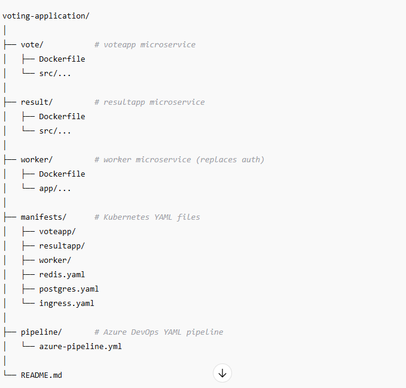

## 📸 Application Screenshots

### 🏠Voting Page

### 🔐 Result Page
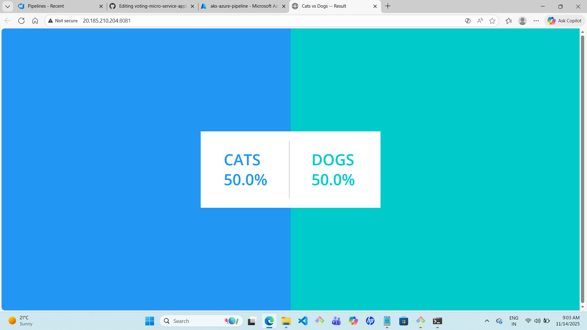

### 🔐 azure-devops-repo Page

### 🔐 CI/CD Pipelines
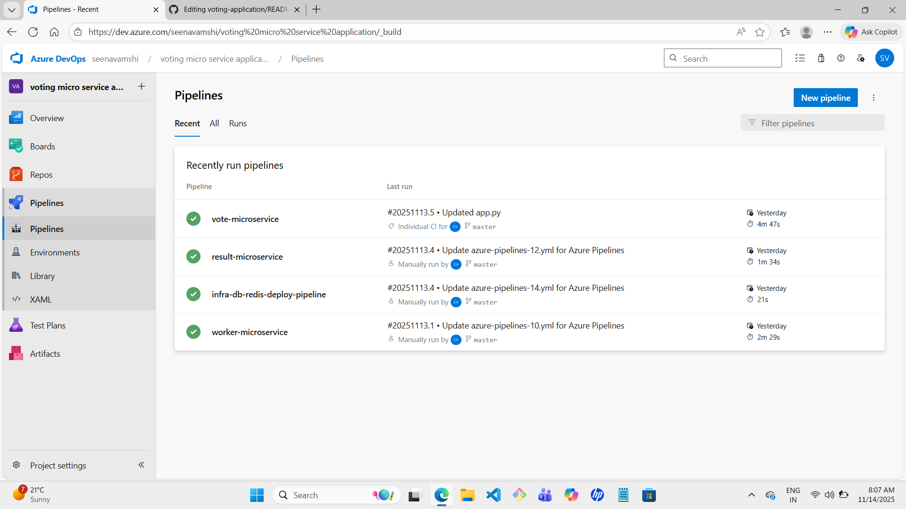

### 🚀 CI/CD Pipelines Success
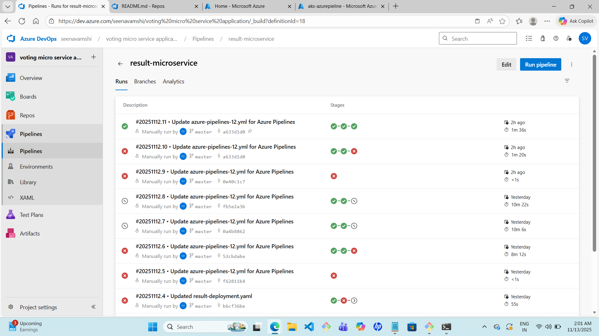

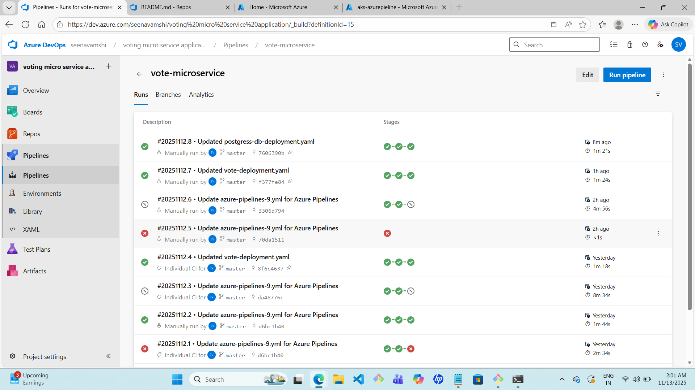

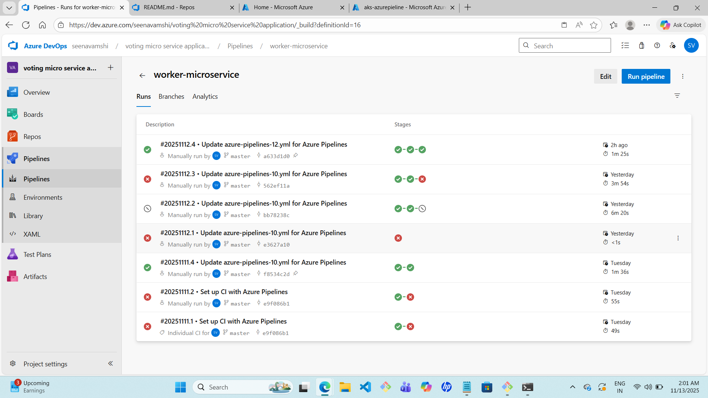

### ✅ repos-AZURE-CONTAINER-REGISTRY
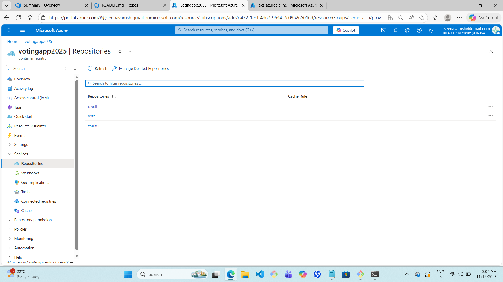

### ✅ Deployments  loads in AKS
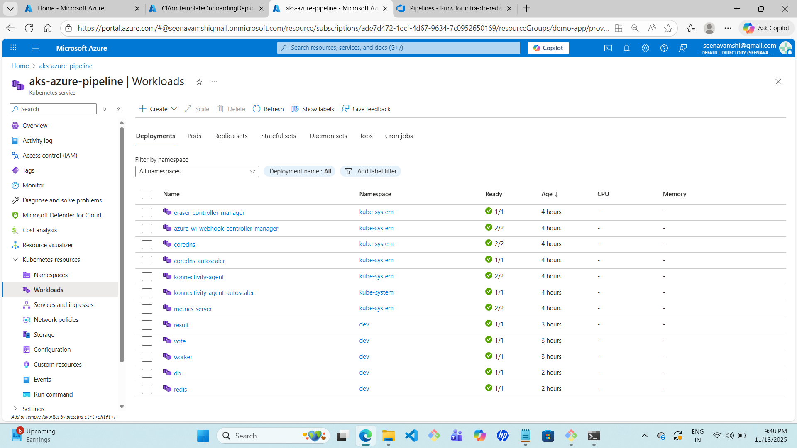

### ✅ Pods Running in AKS

### ✅ Pods Running in AKS terminal
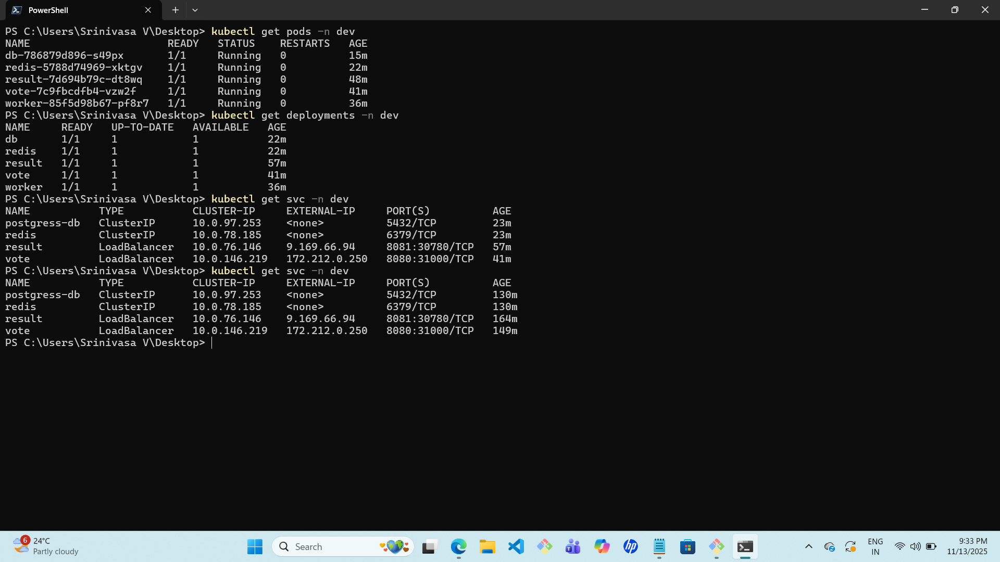

### ✅ configured self-hosted runner for CICD pipeline

### ✅ personal-hosted agent listening for jobs
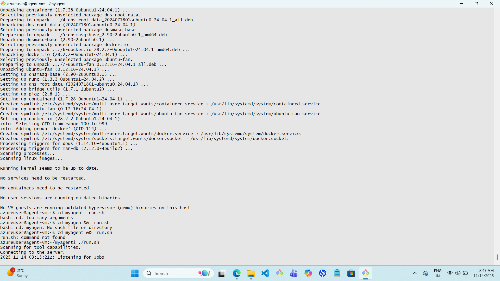

### 🌐 Services
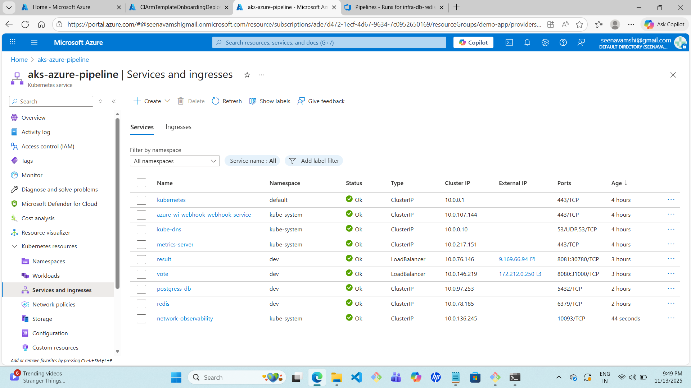

